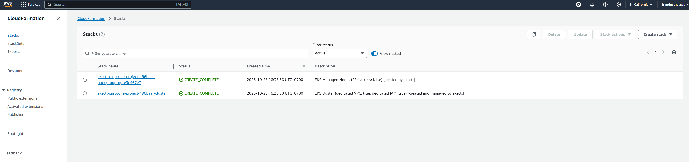

# udacity-capstone

#Github
https://github.com/thaitranduc/udacity-capstone.git

#CircleCi
[](https://dl.circleci.com/status-badge/redirect/gh/thaitranduc/udacity-capstone/tree/main)

# Propose and Scope the Project
1. Create simple web browser with Circle CI to deploy EKS, then build docker image and deploy it to created EKS

# Pick AWS Kubernetes as a Service.
1. ```eksctl``` 
2. ```kubectl``` 

# Build pipeline
1. Steps in CircileCI: 
    - build: Build nodejs webapp
    - push: Create docker image, tag and push to docker hub
    - deploy: Deploy EKS and using docker image created by previous step to setup webapp
2. Configure a deployment pipeline
    - .circleci/config.yml
3. Dockerfile
    - ./frontend/Dockerfile

# Pylint Fail


# Pylint Pass


# CircleCI pipeline


# Docker Repository


# AWS Cloudformation


# EC2 Instances


# K8s Create pipelines


# Browser

http://adf0467cdc2bd451c8ca8c04515a862e-421794244.us-west-1.elb.amazonaws.com:1234/